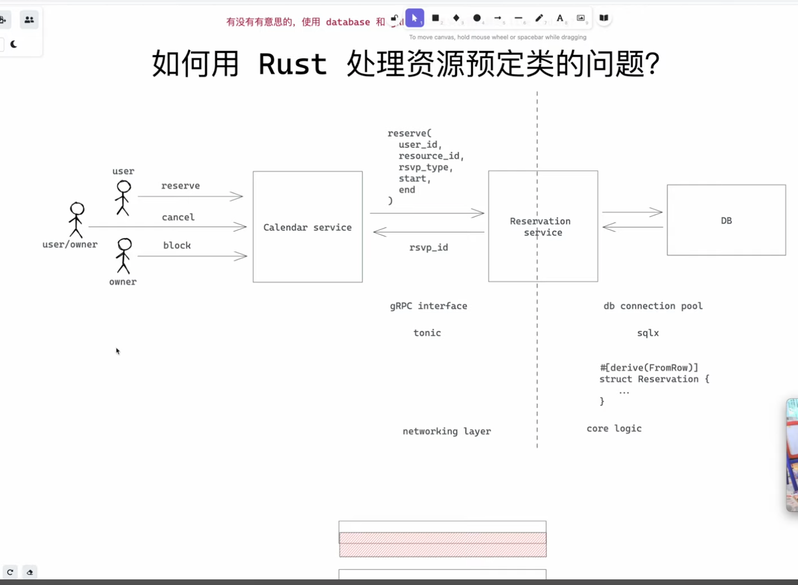
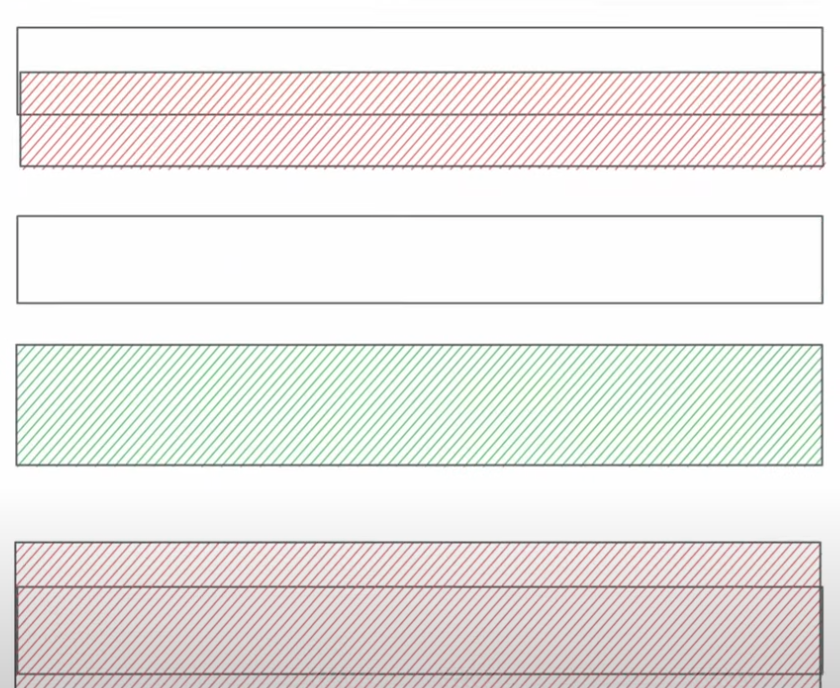
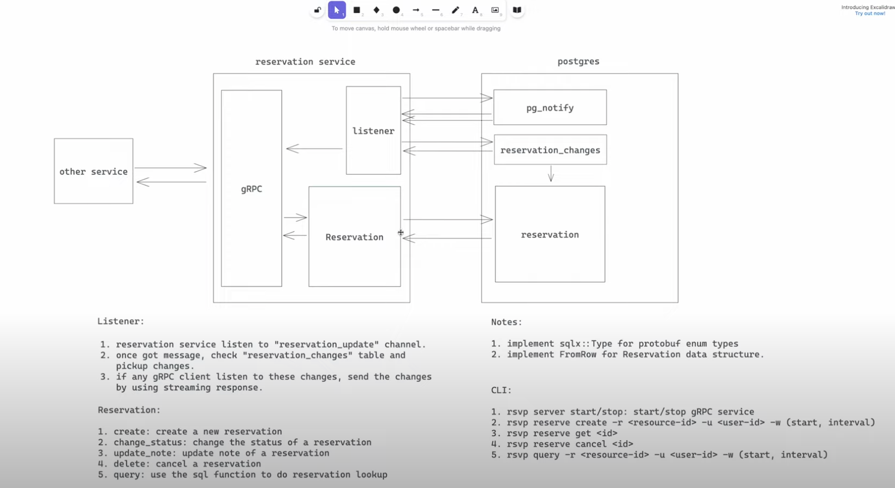

# Core Reservation

- Feature Name: core-reservation-service
- Start Date: 2022-11-06 23:40:44

## Summary

A core reservation that solves the problem of resolving a resource of a period of time, We leverage postgres EXCLUDE constrains to ensure that only one reservation can be made for a given resource at a given time.

## Motivation

We need a common solution for various reservation requirements: 1) calendar booking 2) hotel/room booking 3) meeting room booking 4) parking lot booking 5) etc.Repeatedly building features for these requirements is waste of time and resources. We should have a common solution that can be used by all teams.

Why are we doing this? What use cases does it support? What is the expected outcome?

## Guide-level explanation

Basic architecture:


### Service Interface

We would use gRPC as a service interface. Below is the proto definition:

```proto
enum ReservationStatus {
  UNKNOWN = 0;
  PENDING = 1;
  CONFIRMED = 2;
  BLOCKED = 3;
}
enum ReservationUpdateType {
  UNKNOWN = 0;
  CREATE = 1;
  UPDATE = 2;
  DELETE = 3;
}
message Reservation {
  String id = 1;
  String user_id = 2;
  ReservationStatus status = 3;

  // resource reservation window
  String resource_id = 4;
  google.protobuf.Timestamp start = 5;
  google.protobuf.Timestamp end = 6;

  // extra note
  String note = 7;
}

message ReserveRequest {
  Reservation reservation = 1;
}

message ReserveResponse {
  Reservation reservation = 1;
}

message UpdateRequest {
  String note = 1;
}

message UpdateResponse {
  Reservation reservation = 1;
}
message ConfirmRequest {
  String id = 1;
}

message ConfirmResponse {
  Reservation reservation = 1;
}

message CancelRequest {
  String id = 1;
}
message CancelResponse {
  Reservation reservation = 1;
}

message GetRequest {
  String id = 1;
}
message GetResponse {
  Reservation reservation = 1;
}

message QueryRequest {
  String resource_id = 1;
  String user_id = 2;
  // use status to filter result. if UNKNOWN, return all reservations
  ReservationStatus = 3;
  google.protobuf.Timestamp start = 4;
  google.protobuf.Timestamp end = 5;
}
message ListenRequest {

}
message ListenResponse {
  int8 op = 1;
  Reservation reservation = 2;
}
service ReservationService {
  rpc reserve(ReserveRequest) returns (ReserveResponse);
  rpc confirm(ConfimRequest) returns (ConfimResponse)
  rpc update(Reservation) returns (Reservation);
  rpc cancel(CancelRequest) returns (CancelResponse);
  rpc get(GetRequest) returns (GetResponse);
  rpc query(QueryRequest) returns (stream Reservation);
  // another system could monitor newly added/confirmed/cancelled reservations
  rpc listen(ListenRequest) returns (stream ListenResponse);
}
```

### Database Schema

We use the postgres as the database.Below is the database schema:

```sql
CREATE SCHEMA rsvp;
CREATE type rsvp.reservation_status AS ENUM ('unknown', 'pending', 'confirmed', 'blocked');
CREATE type rsvp.reservation_update_type AS ENUM ('unknown', 'create', 'update', 'delete');
CREATE TABLE rsvp.reservations (
  id uuid NOT NULL DEFAULT uuid_generate_v4(),
  user_id varchar(64) NOT NULL,
  status rsvp.reservation_status NOT NULL DEFAULT 'pending',
  resource_id varchar(64) NOT NULL,
  timespan tstzrange NOT NULL,
  note text,
  -- create_at timestamp with time zone NOT NULL DEFAULT now(),
  -- update_at timestamp with time zone NOT NULL DEFAULT now(),
  CONSTRAINT reservations_pkey PRIMARY KEY (id),
  CONSTRAINT
  reservations_conflict
  EXCLUDE USING gist (resource_id WITH =,timespan WITH &&)
);
CREATE INDEX reservations_resource_id_idx ON rsvp.reservations(resource_id);
CREATE INDEX reservations_user_id_idx ON rsvp.reservations(user_id);
-- if user_id is null find all reservations within during for the resource
-- if resource is null find all reservations within during for the user
-- if both is null find all reservation within during
-- if both set find all reservation within during for the resource and user
CREATE OR REPLACE FUNCTION rsvp.query(uid text, rid text, during: TSTZRANGE) RETURNS TABLE rsvp.reservations AS $$ $$ LANGUAGE plpgsql;

-- reservation change queue
CREATE TABLE rsvp.reservation_changes (
  id SERIAL NOT NULL,
  reservation_id uuid NOT NULL,
  op rsvp.reservation_update_type NOT NULL,
)
-- trigger for add/update/delete a reservation
CREATE OR REPLACE FUNCTION rsvp.reservation_trigger() RETURNS TRIGGER AS
$$
  BEGIN
    IF TG_OP = 'INSERT' THEN
    -- update reservation_changes
    INSERT INTO rsvp.reservation_changes(reservation_id, op) VALUES (NEW.id, 'create');
    ELSIF TG_OP = 'UPDATE' THEN
    -- if stataus changed, update reservation_changes
      IF OLD.status <> NEW.status THEN
        INSERT INTO rsvp.reservation_changes(reservation_id, op) VALUES (NEW.id, 'update');
      END IF;
    ELSIF TG_OP = 'DELETE' THEN
      -- update reservation_changes
      INSERT INTO rsvp.reservation_changes(reservation_id, op) VALUES (OLD.id, 'delete');
    END IF;
    -- notify a channel called reservation_update
    NOTIFY reservation_update;
    RETURN NULL;
  END;
$$ LANGUAGE plpgsql;
CREATE TRIGGER rsvp.reservations_trigger
AFTER INSERT OR UPDATE OR DELETE ON rsvp.reservations FOR EACH ROW EXECUTE PROCEDURE rsvp.reservations_trigger();
```


We also use a trigger to notify a channel when a reservation is added/update/deleted. To make sure even we missed certain messages from the channel when DB conectiton is down for some reason, we use a queue to store the reservation changes. Thus when we receive a notification, We can query the queue to get all the changes since last time we checked, and once we finished processing all the changes, We can delete them from the queue.

### Core flow



## Reference-level explanation

TBD

## Drawbacks

Why should we _not_ do this?

## Rationale and alternatives

N/A

## Prior art

N/A

## Unresolved questions

- how to handle repeated reservation? - is this more or less a business logic which shouldn't be put into this layer?
(no-goal: we consider this is a business logic and should be handled by logic)
- if load is big, We may use external queue for recording changes.
- we haven't considered observability/deployment yet.
- query performance might be an issue - need to revisit the index and also consider using cache.

## Future possibilities
